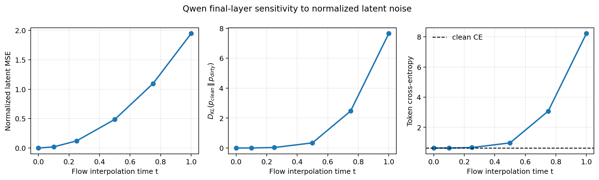
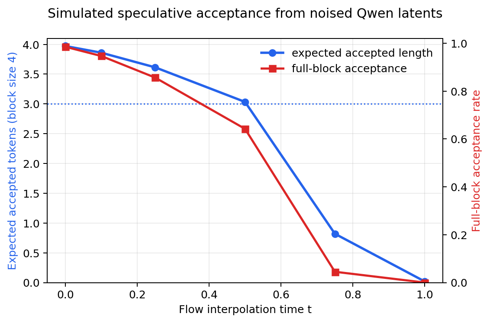

# Qwen latent denoising preserves speculative acceptance below moderate error

Date: 2026-08-20

Reproduction code commit: `ac2f6fd5e7dd08435ff6fb5d01666371402935dc`

## Question

How accurately must a latent denoiser reconstruct the normalized residual stream
entering Qwen's final transformer layer for blockwise greedy predictions to remain
useful for speculative decoding?

## Method

We calibrated one mean and standard deviation per hidden coordinate using all 7,473
examples in the GSM8K training split. We then evaluated 16 held-out GSM8K examples
(2,416 answer-token positions) using Qwen3-1.7B-Base.

For normalized clean latent `x0`, standard Gaussian noise `epsilon`, and interpolation
time `t`, the dirty latent was

```text
xt = (1 - t) * x0 + t * epsilon.
```

We denormalized `xt`, passed it through Qwen's frozen final transformer layer, final
normalization, and language-model head, and compared it with the logits produced from
the untouched clean residual stream. Latent/logit position `i` scores actual token
`i + 1`.

For simulated speculative decoding, dirty-logit greedy tokens were proposals and
clean-logit greedy tokens were verifier decisions. Acceptance is the longest matching
prefix within each complete four-token block. Each block uses clean preceding context;
this teacher-forced diagnostic isolates latent decoding quality and does not model
error accumulation after a rejection.

The normalization artifact and result JSON are intentionally stored outside the
repository:

```text
/home/patrick/.cache/e2d/outputs/diagnostics/qwen-latent-norms/normalization_stats.pt
/home/patrick/.cache/e2d/outputs/diagnostics/qwen-latent-interpolation/speculative-block4.json
```

## Results





| t | Normalized latent MSE | Clean-to-dirty KL | Clean CE | Dirty CE | Expected accepted length | Full-block acceptance |
|---:|---:|---:|---:|---:|---:|---:|
| 0.00 | 0.0000 | 0.0003 | 0.6276 | 0.6271 | 3.972 | 98.5% |
| 0.10 | 0.0195 | 0.0047 | 0.6276 | 0.6301 | 3.860 | 94.6% |
| 0.25 | 0.1216 | 0.0333 | 0.6276 | 0.6578 | 3.614 | 85.6% |
| 0.50 | 0.4864 | 0.3435 | 0.6276 | 0.9671 | 3.033 | 64.2% |
| 0.75 | 1.0944 | 2.4706 | 0.6276 | 3.0753 | 0.819 | 4.5% |
| 1.00 | 1.9455 | 7.6463 | 0.6276 | 8.2185 | 0.018 | 0.0% |

At normalized latent MSE 0.486, the simulated expected accepted length remains
3.03 out of 4 tokens. This supports latent denoising as a viable drafting mechanism:
the decoder tolerates substantial hidden-state reconstruction error before greedy
agreement collapses.

The important difficulty is concentrated late in the flow path. Between `t = 0.5`
and `t = 0.75`, latent MSE increases by about 0.61, but expected accepted length falls
from 3.03 to 0.82 and dirty CE rises from 0.97 to 3.08. Pure noise at `t = 1` is nearly
useless. Training improvements in approximately the `t = 0.75--1.0` region are
therefore likely to have disproportionate effects on one-step generation quality.

The small nonzero KL and imperfect acceptance at `t = 0` come from comparing the
untouched BF16 clean residual with the BF16 normalize-then-denormalize path.

## Follow-up ablations

1. Compare velocity, direct-x0, noisy-canvas residual, and previous-block-mean
   residual parameterizations.
2. Run each parameterization with and without stop-gradient self-conditioning.
3. Compare denoiser layers initialized from Qwen with the same architecture initialized
   from scratch. Keep data order, noise, timestep samples, optimizer, and schedule
   fixed, and report convergence and decoder KL by timestep bin. The central question
   is whether Qwen initialization helps language features but makes optimization in
   the high-noise regime harder.
4. Report both aggregate flow MSE and the fraction of examples reaching latent MSE
   below roughly 0.5, since the downstream acceptance curve is strongly nonlinear.
5. Confirm the teacher-forced result with rolled-out speculative decoding from trained
   checkpoints.

## Reproduction

```bash
CUDA_VISIBLE_DEVICES=4 \
E2D_OUTPUT_ROOT=/home/patrick/.cache/e2d/outputs \
uv run python -u scripts/eval/compare_qwen_latent_gaussian_norms.py \
  --model Qwen/Qwen3-1.7B-Base \
  --split train \
  --max-length 768 \
  --target-layer-offset -1 \
  --device cuda \
  --dtype bfloat16

CUDA_VISIBLE_DEVICES=4 uv run python -u \
  scripts/eval/evaluate_qwen_latent_interpolation.py \
  --num-samples 16 \
  --block-sizes 4 \
  --device cuda \
  --output /home/patrick/.cache/e2d/outputs/diagnostics/qwen-latent-interpolation/speculative-block4.json

uv run python scripts/eval/plot_qwen_latent_interpolation.py \
  --input /home/patrick/.cache/e2d/outputs/diagnostics/qwen-latent-interpolation/speculative-block4.json \
  --quality-output docs/findings/qwen_latent_interpolation_quality.png \
  --acceptance-output docs/findings/qwen_latent_interpolation_acceptance.png
```
